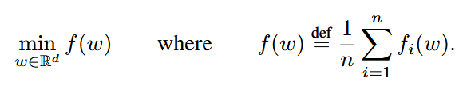

# Update 1.15

# Communication-Efficient Learning of Deep Networks from Decentralized Data (FedAvg)

McMahan, H. B., Moore, E., Ramage, D., Hampson, S., and Agüera y Arcas, B., “Communication-Efficient Learning of Deep Networks from Decentralized Data”, <i>arXiv e-prints</i>, Art. no. arXiv:1602.05629, 2016. doi:10.48550/arXiv.1602.05629.

## Background

**Federated Learning:** Ideal problems for federated learning have the following properties: 

1) Training on real-world data from mobile devices provides a distinct advantage over training on proxy data that is generally available in the data center. 

2) This data is privacy sensitive or large in size (compared to the size of the model), so it is preferable not to log it to the data center purely for the purpose of model training (in service of the focused collection principle). 

3) For supervised tasks, labels on the data can be inferred naturally from user interaction.

**Federated Optimization:** We refer to the optimization problem implicit in federated learning as federated optimization, drawing a connection (and contrast) to distributed optimization. Federated optimization has several key properties that differentiate it from a typical distributed optimization problem:

1. **Non-IID** The training data on a given client is typically based on the usage of the mobile device by a particular user, and hence any particular user’s local dataset will not be representative of the population distribution.
2. **Unbalanced** Similarly, some users will make much heavier use of the service or app than others, leading to varying amounts of local training data.
3. **Massively distributed** We expect the number of clients participating in an optimization to be much larger than the average number of examples per client.
4. **Limited communication** Mobile devices are frequently offline or on slow or expensive connections.

---

### A Simple explanation on the problem

Consider we have a fixed set of $K$ clients, each with a fixed local dataset. At the beginning of each round, a random fraction $C$ of clients is selected, and the server sends the current global algorithm state to each of these clients (e.g., the current model parameters). We only select a fraction of clients for efficiency, as our experiments show diminishing returns for adding more clients beyond a certain point. Each selected client then performs local computation based on the global state and its local dataset, and sends an update to the server. The server then applies these updates to its global state, and the process repeats.

While we focus on non-convex neural network objectives, the algorithm we consider is applicable to any finite-sum objective of the form,



For a machine learning problem, we typically take $f_i(w) = \mathcal{l}(x_i, y_i; w)$, that is, the loss of the prediction on example $(x_i, y_i)$ made with model parameters $w$. We assume there are $K$ clients over which the data is partitioned, with $\mathcal{P}_k$ the set of indexes of data points on client $k$, with $n_k = |\mathcal{P}_k|$. Thus, we can re-write the objective (1) as


If the partition $\mathcal{P}_k$ was formed by distributing the training examples over the clients uniformly at random, then we would have $\mathbb{E}_{\mathcal{P}_k}[F_k(w)] = f (w)$, where the expectation is over the set of examples assigned to a fixed client $k$. This is the IID assumption typically made by distributed optimization algorithms; we refer to the case where this does not hold (that is, $F_k$ could be an arbitrarily bad approximation to $f )$ as the non-IID setting.

## The FederatedAveraging Algorithm

Consider we have $C$ to control the global batch size, with $C = 1$ corresponding to full-batch gradient descent. A typical implementation of FedSGD (Baseline in this paper) with $C = 1$ and a fixed learning rate $η$ has each client $k$ compute $g_k = \nabla F_k(w_t)$, the average gradient on its local data at the current model $w_t$, and the central server aggregates these gradients  and applies the update $w_{t+1} \leftarrow w_t - \eta \sum_{k=1}^K \frac{n_k}{n}g_k$, since $\sum_{k=1}^K\frac{n_k}{n}g_k=\nabla f(w_t)$. An equivalent update is given by $\forall k, w_{t+1}^k \leftarrow w_t - \eta g_k$ and then $w_{t+1} \leftarrow \sum_{k=1}^K \frac{n_k}{n}w_{t+1}^k$. That is, each client locally takes one step of gradient descent on the current model using its local data, and the server then takes a weighted average of the resulting models. Once the algorithm is written this way, we can add more computation to each client by iterating the local update $w^{k+1} \leftarrow w^k \eta \nabla F_k(w^k)$ multiple times before the averaging step. This can be called FederatedAveraging (or FedAvg). The amount of computation is controlled by three key parameters: $C$, the fraction of clients that perform computation on each round; $E$, then number of training passes each client makes over its local dataset on each round; and $B$, the local minibatch size used for the client updates. We write $B = ∞$ to indicate that the full local dataset is treated as a single minibatch. Thus, at one endpoint of this algorithm family, we can take $B = ∞$ and $E = 1$ which corresponds exactly to FedSGD. For a client with $n_k$ local examples, the number of local updates per round is given by $u_k = E \frac{n_k}{B}$; Complete pseudo-code is given in Algorithm 1.


## Experiment

### Image date

In this paper, authors provide two model’s experiment for the MNIST digit recognition task

**Model Ⅰ:** A simple multilayer-perceptron with 2-hidden layers with 200 units each using ReLu activations (199,210 total parameters), which we refer to as the MNIST 2NN.

**Model Ⅱ:** A CNN with two 5x5 convolution layers (the first with 32 channels, the second with 64, each followed with 2x2 max pooling), a fully connected layer with 512 units and ReLu activation, and a final softmax output layer (1,663,370 total parameters).

Also, dataset will be partitioned by two ways. 

**IID:** where the data is shuffled, and then partitioned into 100 clients each receiving 600 examples. 

**Non-IID:** where we first sort the data by digit label, divide it into 200 shards of size 300, and assign each of 100 clients 2 shards.

### language data

For the language data, this paper provide IID version of the dataset, also with 1146 clients. 

On this data we train a stacked character-level LSTM language model, which after reading each character in a line, predicts the next character. The model takes a series of characters as input and embeds each of these into a learned 8 dimensional space. The embedded characters are then processed through 2 LSTM layers, each with 256 nodes. Finally the output of the second LSTM layer is sent to a softmax output layer with one node per character. The full model has 866,578 parameters, and we trained using an unroll length of 80 characters.

### Increasing parallelism

This paper firstly experiment withe the client fraction $C$, which controls the amount of multi-client parallelism. 


The rows correspond to 1, 10 20, 50, and 100 clients. Each table entry gives the number of rounds of communication necessary to achieve a test-set accuracy of 97% for the 2NN and 99% for the CNN, along with the speedup relative to the C = 0 baseline.

### Increasing computation per client

Here, we fix $C=0.1$, and add more computation per client on each round, either decreasing $B$, increasing  $E$, or both. Figure 2 demonstrates that adding more local SGD updates per round can produce a dramatic decrease in communication costs, and Table 2 quantifies these speedups. The expected number of updates per client per round is $u = (\mathbb{E}[n_k]/B)E = nE/(KB)$, where the expectation is over the draw of a random client $k$. As long as B is large enough to take full advantage of available parallelism on the client hardware, there is essentially no cost in computation time for lowering it, and so in practice this should be the first parameter tuned.


### Can we over-optimize on the client datasets?

The current model parameters only influence the optimization performed in each ClientUpdate via initialization. Thus, as E → ∞, at least for a convex problem eventually the initial conditions should be irrelevant, and the global minimum would be reached regardless of initialization. Even for a non-convex problem, one might conjecture the algorithm would converge to the same local minimum as long as the initialization was in the same basin. That is, we would expect that while one round of averaging might produce a reasonable model, additional rounds of communication (and averaging) would not produce further improvements.

Figure 3 shows the impact of large E during initial training on the Shakespeare LSTM problem. Indeed, for very large numbers of local epochs, FedAvg can plateau or diverge. This result suggests that for some models, especially in the later stages of convergence, it may be useful to decay the amount of local computation per round (moving to smaller $E$ or larger $B$) in the same way decaying learning rates can be useful.


## Core Code Explanation

Below is the most important part of FedAvg. In fact, it is about how to compute the weight from different clients which participate into the training process. 

```
# Copy the weight of the current global model net_glob
w_glob = net_glob.state_dict()

# training
loss_train = []
cv_loss, cv_acc = [], []
val_loss_pre, counter = 0, 0
net_best = None
best_loss = None
val_acc_list, net_list = [], []
if args.all_clients:
    print("Aggregation over all clients")
    w_locals = [w_glob for i in range(args.num_users)]
for iter in range(args.epochs):
    loss_locals = []
    # If not all clients, create a list w_locals to store the local weights for each client
    if not args.all_clients:
        w_locals = []
    # Determine the number of clients involved in this round of training m based on the command line arguments args.frac and args.num_users
    m = max(int(args.frac * args.num_users), 1)
    idxs_users = np.random.choice(range(args.num_users), m, replace=False)
    for idx in idxs_users:
        # Perform local updates
        local = LocalUpdate(args=args, dataset=dataset_train, idxs=dict_users[idx])
        # Pass in a copy of the current global model, net_glob, and get the updated weight w and local loss loss
        w, loss = local.train(net=copy.deepcopy(net_glob).to(args.device))
        if args.all_clients:
            w_locals[idx] = copy.deepcopy(w)
        else:
            w_locals.append(copy.deepcopy(w))
        # 将局部损失loss添加到loss_locals列表中
        loss_locals.append(copy.deepcopy(loss))

    # update global weights
    # The FedAvg function is used to aggregate w_locals to get the updated global weight w_glob
    w_glob = FedAvg(w_locals)

    # copy weight to net_glob
    net_glob.load_state_dict(w_glob)

    # print loss
    loss_avg = sum(loss_locals) / len(loss_locals)
    print('Round {:3d}, Average loss {:.3f}'.format(iter, loss_avg))
    loss_train.append(loss_avg)

```

Below is the local update part, actually, it is like the common training part. If we have N clients, then we have N distributed such local updat.

```
class LocalUpdate(object):
	def **init**(self, args, dataset=None, idxs=None):
		self.args = args
	  self.loss_func = nn.CrossEntropyLoss()
	  #Clients which partcipate the training process
	  self.selected_clients = []
	  self.ldr_train = DataLoader(DatasetSplit(dataset, idxs), batch_size=self.args.local_bs, shuffle=True)
# Below is common SGD training process for Single localupdate.
	def train(self, net):
	    net.train()
	    # train and update
	    optimizer = torch.optim.SGD(net.parameters(), lr=self.args.lr, momentum=self.args.momentum)
	    epoch_loss = []
	    for iter in range(self.args.local_ep):
	        batch_loss = []
	        for batch_idx, (images, labels) in enumerate(self.ldr_train):
	            images, labels = images.to(self.args.device), labels.to(self.args.device)
	            net.zero_grad()
	            log_probs = net(images)
	            loss = self.loss_func(log_probs, labels)
	            loss.backward()
	            optimizer.step()
	            if self.args.verbose and batch_idx % 10 == 0:
	                print('Update Epoch: {} [{}/{} ({:.0f}%)]\\tLoss: {:.6f}'.format(
	                    iter, batch_idx * len(images), len(self.ldr_train.dataset),
	                           100. * batch_idx / len(self.ldr_train), loss.item()))
	            batch_loss.append(loss.item())
	        epoch_loss.append(sum(batch_loss)/len(batch_loss))
	    return net.state_dict(), sum(epoch_loss) / len(epoch_loss)

```

# RS-DGC: Exploring Neighborhood Statistics for  Dynamic Gradient Compression on Remote  Sensing Image Interpretation

W. Xie, Z. Wang, J. Ma, D. Li and Y. Li, "RS-DGC: Exploring Neighborhood Statistics for Dynamic Gradient Compression on Remote Sensing Image Interpretation," in IEEE Transactions on Geoscience and Remote Sensing, vol. 62, pp. 1-12, 2024, Art no. 5622112, doi: 10.1109/TGRS.2024.3394501.

## Abstract

Distributed deep learning has recently been attracting more attention in remote sensing (RS) applications due to the challenges posed by the increased amount of open data that are produced daily by Earth observation programs. However, the high communication costs of sending model updates among multiple nodes are a significant bottleneck for scalable distributed learning. Gradient sparsification has been validated as an effective gradient compression (GC) technique for reducing communication costs and thus accelerating the training speed. Existing state-of-the-art gradient sparsification methods are mostly based on the “larger-absolute-more-important” criterion, ignoring the importance of small gradients, which is generally observed to affect the performance. Inspired by informative representation of manifold structures from neighborhood information, we propose a simple yet effective dynamic GC scheme leveraging neighborhood statistics indicator for RS image interpretation, termed RS-DGC. We first enhance the interdependence between gradients by introducing the gradient neighborhood to reduce the effect of random noise. The key component of RS-DGC is a neighborhood statistical indicator (NSI), which can quantify the importance of gradients within a specified neighborhood on each node to sparsify the local gradients before gradient transmission in each iteration. Further, a layer-wise dynamic compression scheme is proposed to track the important changes of each layer in real time. Extensive downstream tasks validate the superiority of our method in terms of intelligent interpretation of RS images. For example, we achieve an accuracy improvement of 0.51% with more than 50× communication compression on the NWPU-RESISC45 dataset using VGG-19 network. To the best of our knowledge, this is the first GC method designed for RS images and downstream tasks, achieving a successful trade-off between high compression ratio and performance.

(Shorter Summary: )

## Method

### Problem Definition

A distributed learning system consists of $N$ nodes, and each node can perform local training based on RS dataset $D_n (1 ≤ n ≤ N )$. The purpose of GC is to reduce the gradient elements that need to be transmitted as much as possible without losing the accuracy of the model, thereby minimizing the communication costs. Our aim is to solve the following optimization problem:

$$
min \sum_{i=1}^NC(\phi(g_i, p))\ \ s.t.\ \mathcal{L}_{SGD}(g_i, D_i)\ge \frac{1}{N}\sum_{i=1}^N\mathcal{L}_{S-SGD}\left( \phi(g_i,p^j_i), D_i\right)
$$

where $C(·)$ represents communication cost, $\phi(·)$ represents the operation to the gradients of each node. $\mathcal{L}_{SGD}$ is the loss function using stochastic gradient descent (SGD), and $\mathcal{L}_{S-SGD}$ is the loss function after GC. $g_n$ is gradients at node $n$, $p$ is the global compression ratio.

The gradient sparsification and synchronization using classic data-parallel SGD can be formulated as


At each iteration $t$, $X_t$ is the model parameters, $g_t$ is the local raw gradients, $g^s_t$ is the local gradients after sparsification, and $g^∗_t$ is the global gradients after synchronization. $η$ represents the learning rate. The $Sparse(·)$  function is employed to sparsify the original gradient, thereby setting zeros for most gradient values while retaining important gradients for updates. $Sync(·)$ function denotes the synchronization of gradient information across nodes, typically achieved through methods such as all-reduce, ring all-reduce, and others. 

### Dynamic Compression Strategy

In this section, we have to give different contribution to different layers in our model. 


By employing larger weight values, the input data can exert a more pronounced influence on subsequent layers, thereby amplifying the importance of the given layer. Conversely, smaller weight values attenuate the impact of input data, thereby diminishing the layer’s contribution to the overall network. 

Fig.3 shows policy in this paper (dynamic GC) Specifically, we assess the importance of each layer based on the magnitude of its weight, that is, 

$$
\mu_l^i=|w_l^i|
$$

$w_l^i$  is the $i$th weight of layer $l$.

$|.|$ returns the absolute value of its input.

$\mu_l^i$ is the cross-layer ranking across the whole network by the numerical order. 

Assuming a global compression ratio $p$, the compression ratio of each layer can be easily determined by sparsifying the weights with the lowest ranks. As a result, each weight $w_l^i$ will be transformed  into a sparse representation $\hat{w}_l^i$ whose elements are defined as, if $\mu_l^i$ is among the lowest-rated $\hat{w}_l^i = 0$, otherwise, $\hat{w}_l^i = w_l^i$ . 

A straightforward method for quantifying the importance of each layer of the network is to determine per-layer compression rate pl based on the per-layer sparsity after above operation as,


$G_l$ is the total number of gradients in $l$th layer

$\delta(.)$ is an indicator function, which returns 1 if the input is true, and 0 otherwise.

The definition of $p_l$ equalizes the sparsity of the $l$th layer.

### Neighborhood Statistics Indicator (NSI)

In order to effectively prioritize gradients for transmission, we introduce NSI as a quantifiable measure to assess the significance of gradients. Most existing gradient GC measure the importance of gradients by each individual gradient itself. Differently, we consider a gradient and its neighborhood as a whole.

Generally, a convolution layer transforms an input tensor $\mathcal{X} \in \mathcal{R}^{C\times H_{in}\times W_{in}}$ into an output tensor $\mathcal{Y} \in \mathcal{R}^{C\times H_{out}\times W_{out}}$ by using the filters $\mathcal{W} \in \mathcal{R}^{N\times C\times K_h\times K_w}$, Here, $C$ is the number of the input feature maps, $N$  is the number of the filters, and $K_h$ and $K_w$ are the height and width of a filter, respectively. Since weights and gradients have a one-to-one correspondence, the gradient shape of each convolution layer is consistent with the weight, that is, $g \in \mathcal{R}^{N\times C\times K_h\times K_w}$. We convert the gradients of each layer into tensors on a 2-D plane. Let $g_0$ be a 2-D spatial plane coordinate $(x_0, y_0)$. The Chebyshev distance between $g_0$ and $(x, y)$ on the 2-D plane is defined as


The neighboring gradients $G_p(x_0, y_0)$ defined by Chebyshev distance is a set of gradients that are within $p × p$ patch including $(x_0, y_0)$ itself and is defined as follows:


where $G(x, y)$ is the gradient at position $(x, y)$ in layer $l.$

We measure the importance of gradients in neighborhood $G_p(x_0, y_0)$ by calculating the NSI


where $α$  is the hyperparameter between 0 and 1, and it can be adjusted for different models. $mean_p(x_0, y_0)$ and $std_p(x_0, y_0)$ are the mean of absolute value and standard deviation of the gradients in the neighborhood $G_p(x_0, y_0)$.


Suppose we get the compression ratio corresponding to the nth node and the $l$th layer of the model $p^l _n$, and then we calculate the number of gradients that is need to be preserved


Then, we will preserve all gradient values in the neighborhood corresponding to the Top-k NSI value and transmit the corresponding neighborhood index.

Therefore, our approach can be seen as a variant of Top-k sparsity. It is worth noting that our method differs from Top-k sparsity in two ways. 

1) By introducing gradient neighborhood, we aggregate all the gradients within the specified neighborhood as a unit to mitigate the contingency caused by individual gradients. This approach effectively minimizes the influence of random noise, resulting in smoother and more stable gradients. 

2) Statistic indicators, particularly the standard deviation, assist us in capturing significant yet relatively small gradients; thereby, preventing the model from overfitting. Moreover, these small gradients encompass crucial fine-tuning information regarding the model’s weight, playing a major role in sustaining optimal model performance.

To solve the problem of gradient optimization direction deviation caused by gradient accumulation directly, we can use local gradient accumulation using momentum correction

